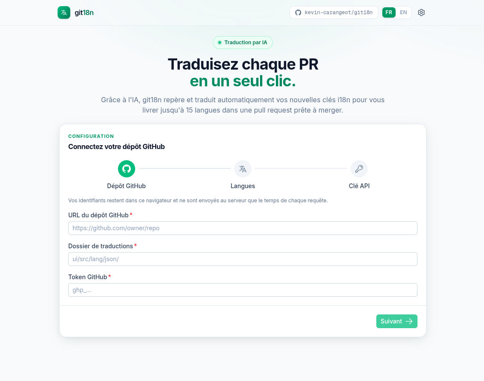
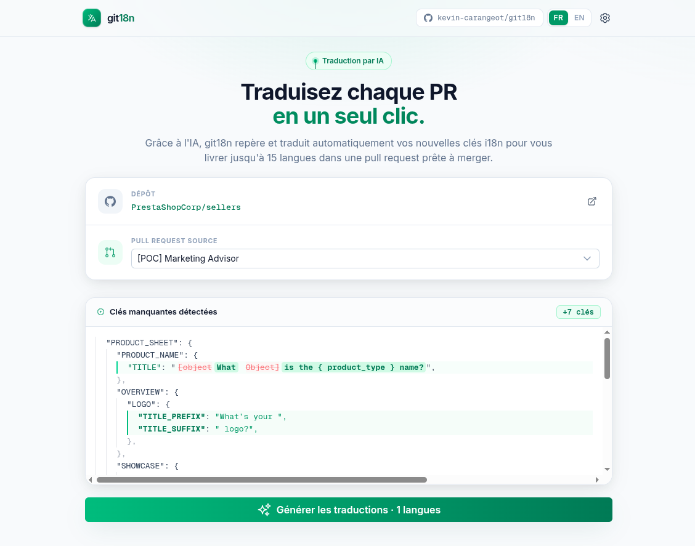
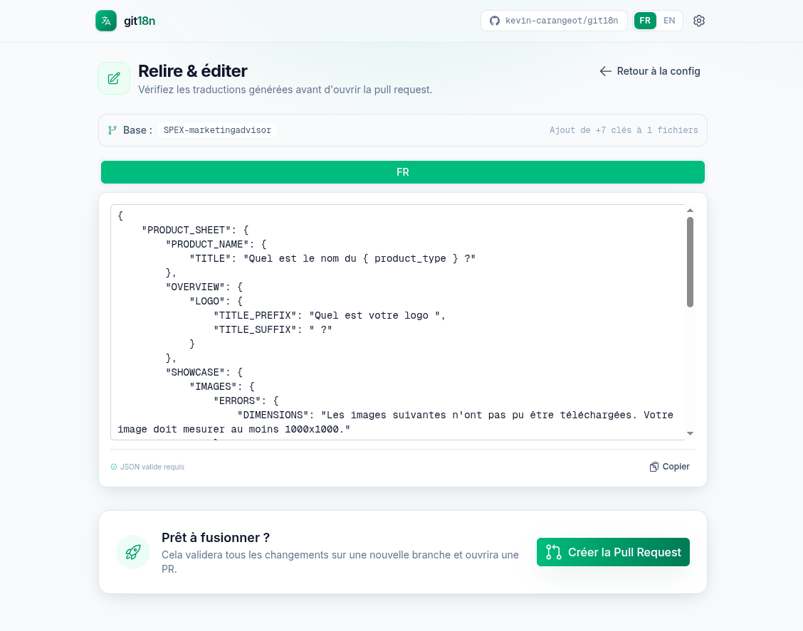

# 🤖 git18n

> **Automated Localization Workflow** — synchronise et traduit automatiquement vos fichiers i18n via IA, directement depuis GitHub.


---

## 📋 Description

**git18n** est une interface web qui automatise la traduction des fichiers de localisation (`i18n`). Au lieu de copier-coller manuellement des clés JSON entre fichiers de langue, l'outil détecte ce qui a changé sur une Pull Request, traduit **uniquement les nouvelles clés** via IA, vous laisse relire le résultat, puis ouvre une PR avec les fichiers mis à jour.

Pensé pour les développeurs et Product Managers : zéro manipulation de fichiers JSON à la main, tout le flux Git est automatisé.

### ✨ Ce qui le distingue

L'outil ne retraduit pas tout le fichier à chaque fois. Il **diffe le fichier source de la branche d'une PR contre la branche par défaut du dépôt** pour isoler les clés ajoutées ou modifiées, et n'envoie que ce delta à l'IA. Résultat : traductions plus rapides, moins de coûts d'API, et aucune écrasure des traductions existantes (les clés intactes sont préservées au merge).

---

## 🔁 Comment ça marche

```
1. Connexion       →  GitHub URL + token + clé Gemini (config dans l'app)
2. Sélection PR    →  Liste des PRs ouvertes du dépôt
3. Diff            →  en.json (branche PR) ⨉ en.json (branche par défaut) = clés nouvelles/modifiées
4. Traduction IA   →  Gemini traduit le delta vers chaque langue cible
5. Revue           →  Relecture et édition des traductions dans l'UI
6. Pull Request    →  Création d'une PR feat/i18n-update-<timestamp> avec les fichiers fusionnés
```

---

## 🖼 Aperçu

**1. Configuration** — connexion du dépôt GitHub, du dossier de traductions et de la clé API.



**2. Détection** — sélection d'une PR ouverte et diff des clés nouvelles ou modifiées.



**3. Revue & PR** — relecture/édition des traductions générées avant ouverture de la pull request.



---

## 🚀 Fonctionnalités

- 🔍 **Explorateur de PR** — liste les Pull Requests ouvertes du dépôt cible.
- ⚡ **Diff intelligent** — ne traduit que les clés ajoutées ou modifiées, jamais tout le fichier.
- 🧠 **Traduction par IA** — génération automatique via Google Gemini, avec respect des placeholders (`{name}`) et du HTML.
- 👀 **Prévisualisation & édition** — vue de diff visuel et éditeur pour relire/corriger avant l'envoi.
- 🌍 **16 langues cibles** — fr, es, de, it, pt, nl, pl, ru, ro, uk, cs, el, sv, da, fi (source : `en`).
- 🚀 **Automatisation Git** — commit par langue et création de PR en un clic, indentation du fichier source préservée.
- 🔐 **Sans secret serveur** — les identifiants restent côté client (voir [Architecture](#-architecture)).

---

## 🛠 Stack technique

| Domaine           | Technologie                                                                                     |
| ----------------- | ----------------------------------------------------------------------------------------------- |
| Framework         | [Nuxt 4](https://nuxt.com/) (mode SPA, `ssr: false`)                                            |
| UI                | [Vue 3](https://vuejs.org/) `<script setup>` + [Nuxt UI 4](https://ui.nuxt.com/) (Tailwind CSS) |
| Langage           | TypeScript                                                                                      |
| i18n de l'app     | [`@nuxtjs/i18n`](https://i18n.nuxtjs.org/) (UI en `en` / `fr`)                                  |
| Traduction        | [Google Gemini](https://ai.google.dev/gemini-api/docs) (`gemini-2.5-flash-lite`)                |
| Source de données | [GitHub REST API](https://docs.github.com/en/rest)                                              |
| Package manager   | `pnpm`                                                                                          |

---

## 🏁 Démarrage

### Prérequis

- **Node.js** v18+
- **pnpm**
- Un **token GitHub** (personal access token) avec accès au dépôt cible
- Une **clé API Gemini** ([Google AI Studio](https://aistudio.google.com/app/apikey))

### Installation

```bash
git clone git@github.com:kevin-carangeot/git18n.git
cd git18n
pnpm install   # exécute aussi `nuxt prepare` (postinstall)
```

### Lancement

```bash
pnpm dev
```

L'application est disponible sur **http://localhost:3000**.

> ℹ️ **Pas de fichier `.env` à remplir.** La configuration (URL du dépôt, dossier des traductions, token GitHub, clé Gemini, langues cibles) se fait **directement dans l'application** via l'assistant de configuration au premier lancement, puis modifiable dans `/settings`. Le `.env.example` n'est conservé qu'à titre de référence.

---

## 🧱 Architecture

### Les identifiants vivent côté client

Il n'y a **aucun secret côté serveur**. L'utilisateur saisit l'URL/token GitHub, le dossier des traductions et la clé Gemini dans un formulaire ; le tout est persisté dans le `localStorage` (clé `git18n-config`). Un plugin Nuxt enveloppe `$fetch` en `$api` et injecte ces valeurs sous forme d'en-têtes `x-git18n-*` sur chaque requête. Les routes serveur les relisent via `getGitConfig`. Cela permet de pointer l'outil vers n'importe quel dépôt sans redéploiement.

### Routes serveur (`server/api/`)

Fines proxies vers GitHub et Gemini :

| Route            | Rôle                                                                                   |
| ---------------- | -------------------------------------------------------------------------------------- |
| `pulls.get`      | Liste les PRs ouvertes                                                                 |
| `pr-diff.get`    | Récupère le fichier source sur la branche PR et la branche par défaut, calcule le diff |
| `translate.post` | Envoie un chunk de diff + langue cible à Gemini                                        |
| `create-pr.post` | Crée la branche, fusionne les traductions par langue, ouvre la PR                      |

### Structure du projet

```
app/
  components/      # ConfigWizard, DiffViewer, TranslationEditor, LanguagePicker…
  composables/     # useGitConfig, useConfigForm
  pages/           # index.vue (flux principal), settings.vue
  plugins/         # api.ts ($api avec injection des en-têtes)
  types/           # config.ts (langues source/cibles)
server/
  api/             # routes proxy GitHub / Gemini
  services/        # clients github.ts, gemini.ts
  utils/           # diff.ts, merge.ts, indent.ts, prompt.ts, git-config.ts
i18n/locales/      # en.json, fr.json (UI de l'app)
```

---

## 📜 Scripts

```bash
pnpm dev          # serveur de développement (http://localhost:3000)
pnpm build        # build de production
pnpm generate     # génération statique
pnpm preview      # prévisualisation d'un build
pnpm lint:fix     # eslint . --fix
pnpm format:fix   # prettier --write .
```

---

## 🎨 Conventions

- **Formatage** : Prettier — tabulations (largeur 4), pas de point-virgule, guillemets simples, `printWidth` 100.
- **Code** : commentaires et identifiants en anglais ; TypeScript strict (pas de `any`).
- **i18n de l'app** : toute chaîne visible passe par `t(...)` avec des clés dans `i18n/locales/{en,fr}.json`.
- **Ajouter une langue cible** : éditer `LANGUAGE_CATALOG` dans `app/types/config.ts`.

---

## 📌 Note

Outil interne — aucune suite de tests ni script de typecheck n'est fourni à ce stade.
